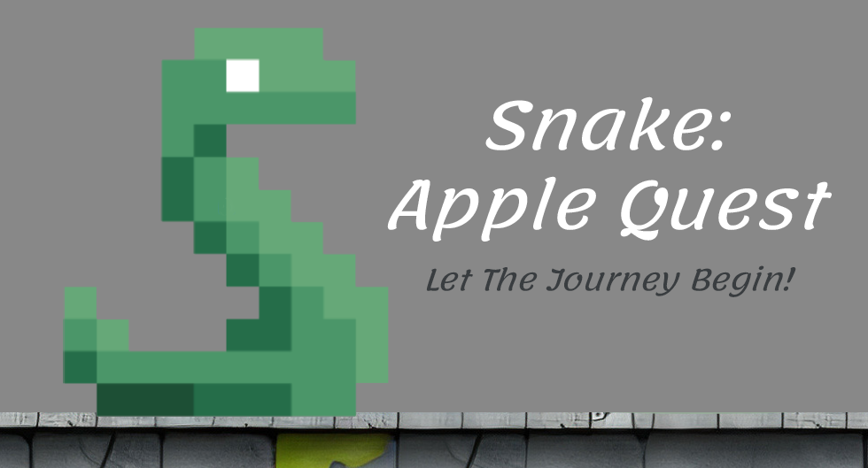

    
 
# Snake: Apple Quest

 

## 📃Table of Content
- [About](#-about)
- [Game Footage](#-game-footage)
- [Installation](#-installation)
 
<h3 id="-about">🚀 About</h3>

#### Story-Driven Gameplay
    The game introduces a narrative in the intro that sets the stage for the player’s quest. 
    This storytelling element motivates players and provides context for their actions, 
    creating a more immersive experience than the classic snake game.

#### Free Movement Mechanics
    Unlike traditional snake games that confine movement to a linear path, players can navigate 
    freely throughou the environment. This opens up new strategies for exploration and 
    interaction, enhancing gameplay dynamics.

#### Combat System
    Players encounter enemies that they must defeat to progress. Each enemy has unique 
    strengths and attack styles (e.g., melee and ranged), requiring players to adapt their 
    tactics, which adds a layer of challenge and excitement.

#### Power-Ups
    Throughout the game, players can collect various power-ups that enhance their abilities,
    such as restoring health, boosting speed, or increasing jump height. This mechanic adds 
    depth to the gameplay, allowing players to customize their approach to challenges.

#### Variety of Levels
    The game features three distinct levels, each presenting unique challenges:
    - Level One: Engages players in combat with enemies using different weapons and tactics.
    - Level Two: Introduces a timer and aerial enemy spawns, emphasizing evasion and quick thinking.
    - Level Three: Culminates in a boss fight against a queen that uses projectiles, leading to a 
      rewarding conclusion.

#### Main and Pause Menu
    The game includes a user-friendly main menu with options for starting a new game (including player 
    name input), viewing the scoreboard, accessing a tutorial, and exiting. The pause menu allows 
    players to pause/resume gameplay and adjust sound settings, enhancing usability.
    
#### Target Audience and Visual Style
    Designed to be challenging yet accessible, the game aims to engage players of all ages. Its visual
    appeal combines pixel art with modern design elements, creating a colorful and detailed aesthetic
    that attracts players.

#### Engaging Soundtrack
    A catchy soundtrack accompanies the gameplay, designed to keep players engaged and enhance the overall
    experience. Music plays a crucial role in setting the game’s tone and maintaining player motivation.

   
 

--------------    
<h3 id="-game-footage">🎥 Game Footage</h3>

 -------------     
<h3 id="-installation">🕹 Installation</h3>

Here is the [game link](https://drive.google.com/file/d/1iSXgjAHjA7KTwXhn_gxQNWuSWQhOtwo7/view?usp=sharing) in a zip file, download, extract, run and enjoy! 

  

